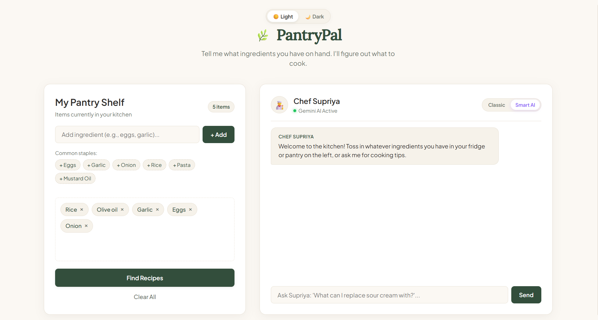
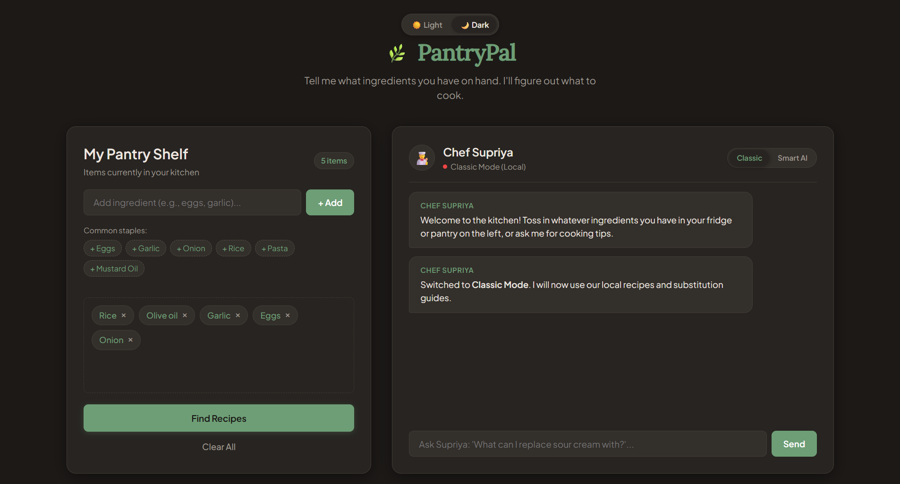
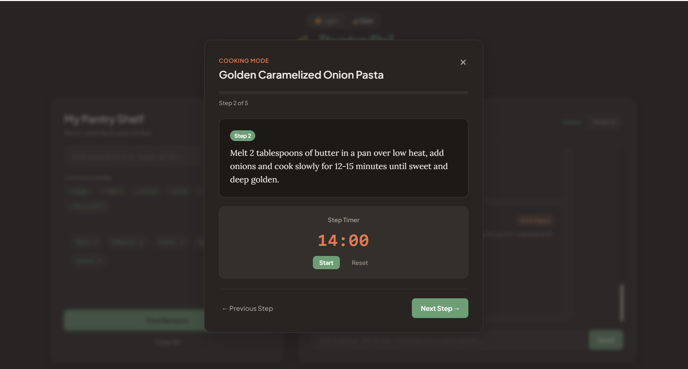
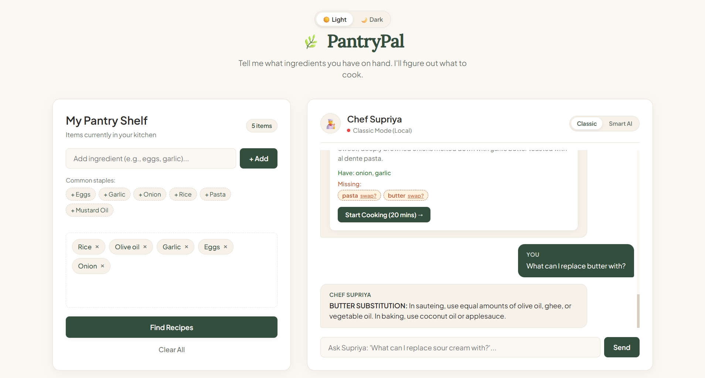

# PantryPal
## Overview
PantryPal is a simple, beginner-friendly web companion built ot solve that problem. You just enter whatever ingredients you have in your kitchen, and it suggests what you can make, helps you swap out missing items, and guides you step-by-step through cooking with a built-in kitchen timer.

Basically, instead of letting vegetables go bad, you put your ingredients on your digital shelf. PantryPal matches them with simple homestyle recipes, tells you what you can replace missing items with (like using yogurt instead of sour cream), and lets you chat with an AI chef when you want creative ideas.

## Features
**Pantry Shelf with Auto-Save:** Type any ingredient or tap quick buttons like eggs, garlic, rice, or mustard oil. Your items show up as small tags that you can remove with a single click. Everything you add stays saved in your browser, so if you refresh or reopen the page, your ingredients are still there.

**Recipe Matching & Match Scores:** Clicking "Find Recipes" checks what you have on your shelf against a collection of practical homestyle meals. Recipes are sorted from best match to lowest, showing you tags like "100% Match • Ready to cook" or "Missing 1 item" so you immediately know what you can make.

**Clickable Ingredient Swaps:** If a recipe needs an ingredient you don't have, it shows a little button like `butter (swap?)`. Clicking it automatically asks the chef what you can use instead, giving you realistic kitchen alternatives so you don't jave to run to grocery store.

**Step-by-Step Cooking Mode with Timer:** When you click "Start Cooking", a clean popup screen open showing one step at a time with a progress bar. FOr steps that take time (like simmering for 3 minutes or boiling pasta for 9 minutes), an interactive timer counts down and plays a pleasant chime when finished. You can even move between steps using your keyboard's left and right arrow keys and exit the mode with esc button.

**Classic vs Smart AI Toggle:** A switch in the chef's header lets you choose how you want help:
* **Classic Mode:** Works completely offline and gives quick, reliable answers for pantry checks and ingredient swaps form our local files.
* **Smart AI Mode:** Connects to Google Gemini AI so you can ask custom questions, ask for new recipe ideas, or get cooking advice for odd food combinations.

**Light & Dark Kitchen Themes:** A toggle button at the top lets you easily switch between a warm paper daytime look and cozy, eye-friendly dark mode for late-night cooking.

## Known Bugs & Limitations
**Timer Sound Permission:** On modern web browsers, the timer sound plays if you have clicked somewhere on the page at least once during your visit (due to standard browser autoplay rules).

**No Exact Measurements Yet:** The pantry tracks whether you have an ingredient or not (like "Onions" or "Rice"), but doesn't track exact quantities like "200 grams" or "2 cups".

## Tech Stack
#### Frontend:
* HTML5 (Page layout and popups)
* CSS3 (Custom styling, animations, and dark/light theme switching)
* JavaScript (Interactive shelf, recipe mathcing, timer logic, and chat)

#### AI & Sound:
* Google Gemini API (For the smart cooking assistant)
* Web Audio API (Generates the timer chime inside the browser without downloading sound files)

## How to use?
1. **Add Ingredients:** Type whatever you have in your kitchen or tap the common staple buttons (like eggs or garlic).
2. **Pick Your Mode:** Use the switch in the chef box to pick **Classic** (quick local answers) or **Smart AI** (Gemini AI).
3. **Find Recipes:** Click "Find Recipes" to see meals ranked by how many ingredients you already have.
4. **Swap Missing Items:** Click on any missing ingredient button to see what you can replace it with.
5. **Cook Step-by-Step:** Click "Start Cooking" to follow the recipe steps. Use the timer for boiling or frying, and navigate with you arrow keys.

## How to run locally
1. **Clone the repository:** `git clone https://github.com/kumarisupriya-dev/PantryPal`
2. **Open the project:** Since this is built with standard web technologies, there are no complicated installation steps. You can just double-click `index.html` to open it directly in any browser, or use a simple local server extension like Live Server.

## AI Usage
* **Chatbot Integration:** Connected the Google Gemini API to give personalized cooking answers and recipe tips.
* **Documentation:** Used AI to help with the structure of the Readme.

## Future Plans
* **Grocery Receipt Scanner:** Let users snap a picture of their grocery bill to add ingredients to the shelf automatically.
* **Add Custom Recipes:** Allow users to save their own favourite recipes into the app.
* **Share Grocery List:** A quick button to send missing ingredients to WhatsApp as a shopping list.
* **Diet Filters:** Quick filters for Vegetarian, Vegan and Gluten-Free meals.

## Screenshots of the Project

